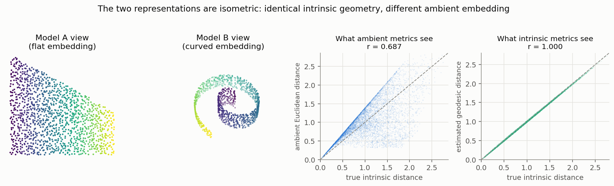
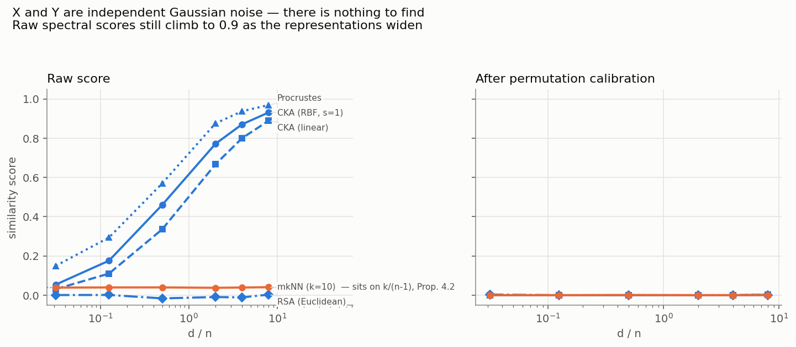
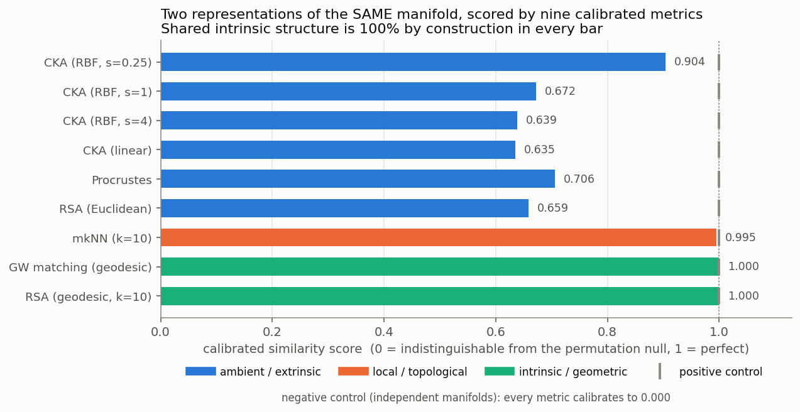
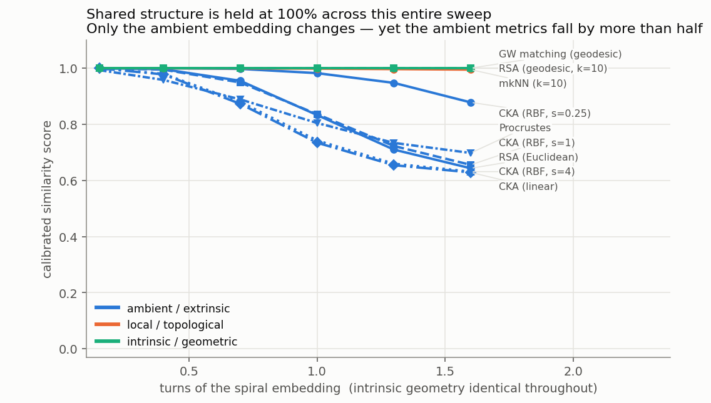

# Benchmarking manifolds with calibrated similarity scores

## The question


The Gröger paper shows that similarity metrics like CKA have a non-zero expected
value under the null hypothesis of no relationship, which grows with model complexity.
Their calibrated score tries to account for this by comparing to a baseline null
using a permuted dataset, and argue that if you compare to this null, the scaling
trends appear to vanish. 

However, their test don't show that there is no similarity, just that the scaling
trends disappear. But these metrics may not cature similarity completely. Linear 
CKA, RBF CKA, RSA, etc are computed using the Euclidean embedding, and are invariant
only to rotation and isotropic scaling. Embedding a manifold into Euclidean space
only requires a smooth bijection, which can be far more complicated, so perhaps
there's still structure that ambient metrics aren't seeing.

## The design

Take two point clouds that are **isometric by construction**: two embeddings of
the same abstract Riemannian manifold (in our choice, just a simple rectangle) into
different embeddings. The shared intrinsic structure is known exactly, while the
ambient geometry is very different.

The abstract manifold is a flat, convex planar domain. Because it is flat and
convex, geodesics are straight lines in the chart so the distance is just the
Euclidean distance, which will be our ground truth. `Model A` embeds it
trivially; `Model B` rolls it onto a curved surface; a spiral or cylinder. 
Both are then lifted into ambient spaces of different width by random
orthonormal frames, which is what two different models would differ by even if
they had learned exactly the same thing.



Nine metrics are run on these pairs, in three families by what geometry they can
see:

| family | metrics | sees |
|---|---|---|
| ambient / extrinsic | linear CKA, RBF CKA (σ ∈ {0.25, 1, 4}), Euclidean RSA, Procrustes | ambient inner products and distances |
| local / topological | mkNN (k=10) | which points are neighbours |
| intrinsic / geometric | geodesic RSA, Gromov–Wasserstein matching | distances along the manifold |

Every one is calibrated with the permutation null from Gröger et al. — critical
value τ<sub>α</sub> from the combined observed-plus-null order statistics,
max-preserving calibrated score, add-one p-values, α = 0.05, K = 200 permutations.

## Check: the calibration implementation reproduces the paper

As a quick check, we should see that this setup recreates the results from the Gröger
paper. With X and Y drawn independently from N(0, I<sub>d</sub>) at fixed n = 256 — nothing
shared, we expect to see zero everywhere:



Raw linear CKA climbs from 0.031 to 0.890 as d/n goes from 0.03 to 8, on pure
noise. Raw mkNN stays flat at ≈0.039 regardless of width. After calibration every
cell mean sits at ≤0.003 with no trend in d which is what we expect to see. So
we see CKA inflated just off of d/n even when there is no real signal.
Additionally, proposition 4.2 predicts the mkNN null baseline should be exactly
k/(n−1) = 0.039216; the observed mean is 0.039259, a 0.11% error.


## Result 1: Calibrated Scores for Isometric Pairs



Positive control (same embedding, different ambient basis): every metric 1.000.
Negative control (independent manifolds): every metric 0.000.

On the isometric pair, with shared intrinsic structure at 100% by construction:

| metric | family | calibrated |
|---|---|---|
| geodesic RSA | intrinsic | **1.000** |
| GW matching | intrinsic | **1.000** |
| mkNN (k=10) | local | 0.995 |
| CKA (RBF, σ=0.25) | ambient | 0.904 |
| Procrustes | ambient | 0.706 |
| CKA (RBF, σ=1) | ambient | 0.672 |
| RSA (Euclidean) | ambient | 0.659 |
| CKA (RBF, σ=4) | ambient | 0.639 |
| **CKA (linear)** | ambient | **0.635** |

Linear CKA reports 0.635 for two representations that have identical geometry. 
Only being invariant to scaling and rotation is costing us when we embed into
Euclidean space.

## Result 2: Manifold-Native Metrics

Now, we vary how tightly the spiral embedding winds and see how this affects the similarity metrics.



| turns | 0.15 | 0.40 | 0.70 | 1.00 | 1.30 | 1.60 |
|---|---|---|---|---|---|---|
| CKA (linear) | 0.999 | 0.978 | 0.873 | 0.734 | 0.654 | **0.628** |
| RSA (Euclidean) | 1.000 | 0.996 | 0.955 | 0.833 | 0.710 | 0.643 |
| Procrustes | 0.993 | 0.958 | 0.889 | 0.805 | 0.734 | 0.698 |
| mkNN (k=10) | 1.000 | 1.000 | 0.999 | 0.998 | 0.997 | 0.995 |
| geodesic RSA | 1.000 | 1.000 | 1.000 | 1.000 | 1.000 | **1.000** |
| GW matching | 1.000 | 1.000 | 1.000 | 1.000 | 1.000 | **1.000** |

Shared structure is constant along every column. Calibrated linear CKA still falls by
37%. A metric measuring shared structure should be flat at 1.0 here while the ambient 
metrics seem to drop as the embedding gets more curved.

## Thoughts
The main conclusion should be that we need to scrutinize readings from ambient metrics
like CKA and RSA, especially after calibration. It's invariants are not general enough
to capture manifolds embedded in Euclidean space, and the choice of the embedding can
lead to completely different results.

Manifold aware metrics like GW and geodesic RSA are able to capture this however, and
can spot similarity regardless of embedding. So while this doesn't necessarily prove it,
it is possible that convergence is real and that our current metrics to measure similarity
weren't faithful to the problem.

Additionally, there are obviously some limitations to these tests. The manifolds in question
are only two dimensional with no curvature. Real representations are very high dimensional, noisy,
and far more complicated than these tests. We can't say for certain how this will generalize
to real representations, only that its a possibility.

A next step (as per the project proposal) is to run calibrated GW, and geodesic RSA along with 
calibrated CKA and mkNN on the vision-language models that the Gröger paper did, and then see 
if GW sees the scaling trend that the ambient metrics didn't. Note that the null calibration 
procedure isn't applicable here because shuffling points does not change the GW score. This
is because GW doesn't necessarily measure a 1-1 correpondance, but optimal transport, so a different
calibration procedure is needed.

## Reproducing

```bash
pip install -r requirements.txt

python experiments/check_isometry.py       # ~3s   verify the construction first
python experiments/run_width_sweep.py      # ~8m   reproduce the width confounder
python experiments/run_type1.py            # ~15m  Type-I error control
python experiments/run_main.py             # ~30m  main result
python experiments/run_curvature_sweep.py  # ~28m  the central sweep
python experiments/make_figures.py         # ~1m
```

Results are written to `results/` as JSON.

```
isoblind/
  manifolds.py     isometric embeddings + analytic ground-truth distances
  geodesics.py     graph-geodesic estimation and its self-checks
  metrics.py       nine metrics behind one prepare/score interface
  calibration.py   the permutation null, τ_α, calibrated score, p-values
  plotting.py      shared figure style
```

## References

- Gröger, F., Wen, S., Brbić, M. (2026). *Revisiting the Platonic Representation Hypothesis: An Aristotelian View.* ICML. [arXiv:2602.14486](https://arxiv.org/abs/2602.14486)
- Huh, M., Cheung, B., Wang, T., Isola, P. (2024). *The Platonic Representation Hypothesis.* ICML.
- Wurgaft, D. et al. (2026). *Manifold Steering Reveals the Shared Geometry of Neural Network Representation and Behavior.* [arXiv:2605.05115](https://arxiv.org/abs/2605.05115)
- Kornblith, S., Norouzi, M., Lee, H., Hinton, G. (2019). *Similarity of Neural Network Representations Revisited.* ICML.
- Mémoli, F. (2011). *Gromov–Wasserstein Distances and the Metric Approach to Object Matching.* Foundations of Computational Mathematics.
- Tenenbaum, J., de Silva, V., Langford, J. (2000). *A Global Geometric Framework for Nonlinear Dimensionality Reduction.* Science.
